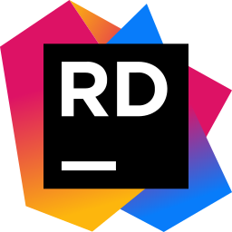

#  About me
I'm a typical teenager in many ways. Currently, I'm studying Computer Science at a university, and I'm really passionate about learning new programming languages and coding principles – Java and C# are my top choices right now. During my free time, I enjoy creating fun programs that might not serve a real purpose, but they help me learn more about coding.

Independence is a big part of who I am. Even though I'm just 20, I consider myself quite mature and capable of taking care of myself. I have a clear sense of my goals in life. I don't shy away from pursuing what I want, and I always ensure I receive what I've earned.

Looking ahead, I envision myself working as a software engineer. My goal is to contribute to fresh and innovative projects that stretch the boundaries of what's achievable. As I progress in my career, my aim is to reflect on my achievements with a sense of pride.
###  Project that I'm working on right now:
-  [Tutil](https://github.com/TawayDev/Tutil) - A wrapper library for my other Java projects
#### :fire: List of projects You might be interested in:
-  [GPTCSV](https://github.com/TawayDev/GPTCSV) - CLI application that sends and receives data from GPT3
-  [IPScanner](https://github.com/TawayDev/IPScanner) - CLI application that can scan ip ranges
-  [FreezeCheck_CLI](https://github.com/TawayDev/FreezeCheck_CLI) - CLI application which checks if ToolWizTimeFreeze is running
-  [MCL_Overseer](https://github.com/TawayDev/MCL_Overseer) - SpigotMC plugin for managing players and logging their behavior on a Minecraft server
-  [PotionWalker](https://github.com/TawayDev/PotionWalker) - PaperMC plugin that adds different potion effects if a player is walking on different blocks
> **NOTE:** Most of my interesting projects are private on Github.

### My favorite programming languages:
&nbsp;

&nbsp;&nbsp;&nbsp;

### Tools I use (or have used before):
 &nbsp;&nbsp;&nbsp;  &nbsp;&nbsp;&nbsp;  
 &nbsp;&nbsp;&nbsp;  &nbsp;&nbsp;&nbsp;  
&nbsp;&nbsp;&nbsp;&nbsp;&nbsp;&nbsp;&nbsp;&nbsp;&nbsp;&nbsp; 
&nbsp;&nbsp;&nbsp;&nbsp;&nbsp;&nbsp;

### Spoken languages:
<table>
    <tr>
        <th></th>
        <th>Czech (native)</th>
    </tr>
    <tr>
        <th></th>
        <th>English (C1)</th>
    </tr>
</table>

### Have I interested You? **Contact me!**
-  [Telegram](https://t.me/tawaydev)
-  [Discord](https://discordlookup.com/user/319082278204735488)
-  [Twitter](https://twitter.com/TawayVT)

### Other information
- Age: 21
- Gender: Male
- 16Personalities: ISTP-T
- Favorite Color:  #d9303b 
- Hobbies: Programming, Gaming & Streaming.

### Computer specs:
-  CPU: AMD Ryzen 7 5700x  
-  GPU: Gigabyte 3060 EAGLE 12GB
-  Motherboard: MSI B550 Tomahawk  
-  RAM: Kingston FURY 2x16GB DDR4  
-  SSD: Samsung 980 1TB M.2  
-  HDDs: 1TB Seagate Barracuda, 2TB Seagate Barracuda  
-  PSU: Corsair RM850
